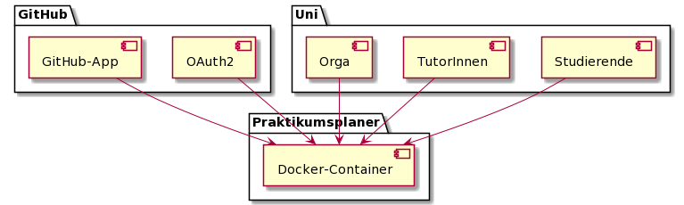
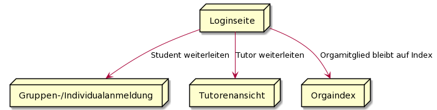
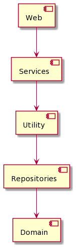
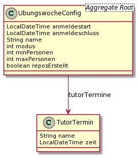
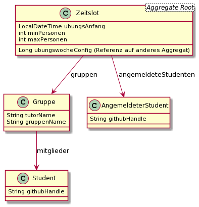

= Arc Dokumentation
:icons: font
:icon-set: fa
:source-highlighter: rouge
:experimental:
ifdef::env-github[]
:tip-caption: :bulb:
:note-caption: :information_source:
:important-caption: :heavy_exclamation_mark:
:caution-caption: :fire:
:warning-caption: :warning:
:stem: latexmath
endif::[]


== Einführung


=== Aufgabenstellung
* Anmeldungssystem zu den praktischen Übungen mit Individual- und Gruppenanmeldung
* Repositories werden automatisch in einer Organisation auf Github erstellt

=== Qualitätsziele
* Wartbarkeit
* Benutzerfreundlichkeit
* Stabilität, Verfügbarkeit


=== Stakeholder
* Propra Organisationsteam
* Studenten

[cols="1,1,1"]
|===
| *Rolle*
| *Kontakt*
| *Erwartungshaltung*

| Jens
| propra@cs.uni-duesseldorf.de
| Auftraggeber


| Propra Organisationsteam
| propra@cs.uni-duesseldorf.de
| Benutzer und Admins des Systems


| Studenten
| -
| Benutzer


|===

=== Randbedingungen

* Spring
* Docker
* Datenbank im externen Prozess

=== Fachlicher Kontext



=== Ebene 1 der Bausteinsicht


=== Risiken

* Datensicherheit

=== Entwurfsentscheidungen
* Wir haben uns für eine Schichtenarchitektur entschieden.



* Wir haben unsere Domaine in zwei Aggregate aufgeteilt und diese werden durch Spring Data JDBC persistiert.

* Im UbungswocheConfig Aggregat werden Information zur einer praktischen Übung gespeichert, dazu gehören auch die Übungstermine der Tutoren.




* Im Zeitslot Aggregat wird die Gruppenverteilung der Studenten gespeichert.




==== Warum wir einige Regeln durch ```@SuppressWarnings``` und checkstyle.xml ausgeschaltet haben

* Checkstyle / PMD: Dokumentationsregeln ausgeschaltet, da wir eine eigene Dokumentation erstellen bzw. keine JavadocComments verwenden

* ```PMD.ShortVariableName```: Wir benutzen ```id``` als Primärschlüssel für Tabellen in der Datenbank, somit erreichen wir eine höhere Konsistenz mit dieser im Java-Code.

* ```PMD.DataflowAnomalyAnalysis```: Im ```GitHubService``` haben wir die GitHub-API aus dem vorgeschlagenen Video verwendet, der Code wird von PMD mit einer Anomalie geflaggt. Manchmal widersprechen sich ```PMD.OnlyOneReturn``` und ```PMD.DataflowAnomalyAnalysis``` (Beispiel: ```doesUserExist```).

* ```PMD.AtLeastOneConstructor```: In manchen Klassen brauchen wir keinen Konstruktor.

* ```PMD.LawOfDemeter```: Bei API-Klassen mit dem Builder-Pattern wäre die Einhaltung von LOD nicht umsetzbar (Beispiel: ```WebSecurityConfiguration```).

==== Warum wir die Spring-Validation-API nicht verwendet haben

* Da wir Form-Daten nicht serverseitig (und damit für jeweils einen Nutzer) speichern, speichern wir diese in ```<input type=hidden>```. Dadurch müssen wir neben dem Model auch ein ```HttpServletRequest``` in die Mappings injecten, um die Form-Daten auszulesen. Genau das verhindert aber leider die Verwendung von ```@Valid``` an einem Formobjekt. Spring hat dann die fehlerhaften Felder nicht in ein ```BindingResult``` injected, sondern einen ```FieldError``` geworfen.

* In ```web.form``` haben wir daher eine abstrakte Base-Klasse ```AbstractBelegenForm``` erstellt, von der mehrere Klassen erben. Dort setzen wir einige Dinge, wie Zeitslot-IDs oder GitHub-Handles, die validiert werden sollen und rufen ```validateForm``` auf. Die fehlerhaften Werte werden dann erkannt und entsprechende Fehlermitteilungen ("Alerts") ausgewählt. Diese fügen wir dann einfach ins Model hinzu und iterieren via Thymeleaf über die Alerts.

== Glossar

* ```TutorTermin```: Speichert einen Termin (```LocalDateTime```) und einen Tutor. Wird in der Konfiguration genutzt
* ```Zeitslot```: Speichert einen Termin und die zugehörigen Gruppen. Wird für die Terminverteilung verwendet
